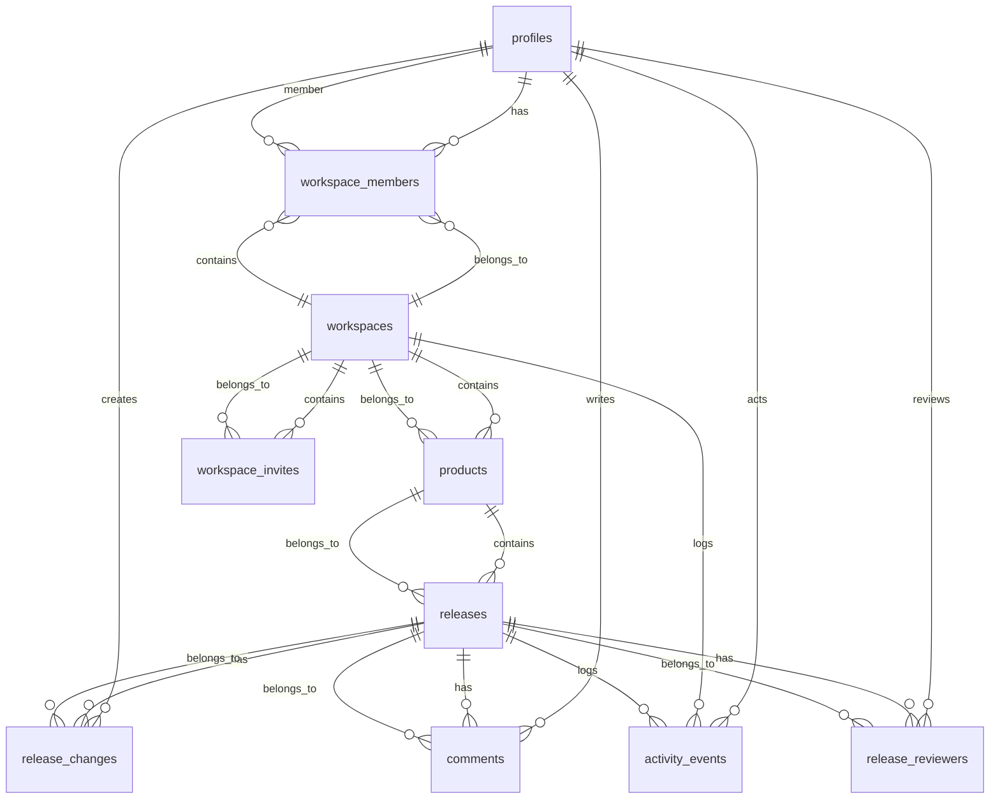

# ReleaseHub

ReleaseHub — это веб-приложение для управления релизами продукта внутри рабочих пространств. Проект объединяет три сценария: создание и администрирование workspace, подготовка release notes, процесс согласования релизов с ролями, проверками статусов и публичной публикацией готовых заметок.

Основной стек:

- React 19 + TypeScript + Vite
- Supabase Auth + Postgres + RLS
- React Query для серверного состояния и кеша
- Realtime subscriptions для синхронизации данных
- Tailwind CSS для UI

## Описание проекта

Приложение предназначено для команд, которые выпускают релизы и хотят управлять процессом в одном месте:

- создавать рабочее пространство и продукт;
- хранить релизы, изменения, комментарии и историю активности;
- назначать согласующих и контролировать жизненный цикл статусов релиза;
- публиковать публичные release notes для внешних пользователей;
- ограничивать действия пользователей ролями `owner`, `maintainer`, `contributor`.

Основные сущности:

- `workspaces` — учётные пространства команд;
- `workspace_members` — участники и роли в пространстве;
- `products` — продукты внутри workspace;
- `releases` — релизные ветки с состояниями `draft`, `review`, `approved`, `rejected`, `published`;
- `release_changes` — изменения по релизу;
- `comments` — комментарии к релизу;
- `release_reviewers` — назначенные согласующие и их решения;
- `workspace_invites` — приглашения в workspace с токенами и сроком действия;
- `activity_events` — журнал действий;
- `profiles` — профили пользователей, связанные с Auth.

## Архитектурные решения

### 1. Клиент и серверное состояние

Проект разделяет состояние на:

- локальное React-состояние для форм, модалок и drag-and-drop;
- серверное состояние в React Query;
- источник правды в Supabase/Postgres.

Все списки и детали загружаются через `supabase.from(...)` или `supabase.rpc(...)`, а после изменений кеш обновляется как локально (optimistic update), так и через Realtime invalidate/refetch. Это даёт быстрый UX без ручного синхронного управления состоянием на каждом экране.

### 2. Supabase как система авторизации и безопасности

Доступ к данным регулируется RLS-политиками в Postgres. Для критических операций используются `SECURITY DEFINER` RPC-функции, которые проверяют права после `auth.uid()` и обеспечивают atomic update/insert/delete операции.

**Важно:** изменение статуса релиза и публикация выполняются через RPC (`submit_release_for_review`, `cast_release_vote`, `publish_release`, `return_rejected_release_to_draft`, `cancel_published_release`). При этом UI использует optimistic update для локального кеша, а финальная валидация происходит на стороне БД. Прямое обновление полей `status` и `published_at` через `supabase.from('releases').update(...)` из клиента заблокировано RLS-политикой `"Owners and maintainers can update non-status release fields"`.

### 3. Модель приглашений

Вместо простого добавления записи в `workspace_members` используется отдельная таблица `workspace_invites` с токеном, сроком действия (7 дней) и статусом (`pending`, `accepted`, `expired`, `revoked`). Приглашение создаётся через RPC `create_invite`, принимается через `accept_invite` (с проверкой email владельца токена), может быть отозвано (`revoke_invite`) или повторно отправлено (`resend_invite`). Это отклоняется от упрощённой модели, где приглашение сразу создаёт `workspace_members`.

### 4. Workflow релиза как бизнес-логика

Переходы статусов реализованы в отдельном модуле `releaseWorkflow.ts` и дополнительно проверяются в UI. Допустимые переходы: `draft → review → approved → published`, а также `review → rejected → draft`. Это позволяет избежать неоднозначных сценариев и не допустить некорректные переходы из интерфейса.

### 5. Realtime синхронизация

Подписки формируются через `supabase.channel(...)` в `useSupabaseRealtime.ts` и обновляют cache по ключам React Query, что позволяет синхронизировать список релизов, ревьюеров, комментарии и activity без перезагрузки страницы.

### 6. Типизация данных

Типы базы генерируются из Supabase командой `supabase gen types` и сохраняются в `src/shared/api/database.types.ts`. Благодаря этому TypeScript знает структуру таблиц и RPC-аргументов, а интерфейс и SQL остаются согласованными.

## ER-диаграмма



## Локальный запуск

### Требования

- Node.js 24+
- npm
- Supabase CLI
- доступ к интернету для подключения к Supabase

### 1. Установка зависимостей

```bash
npm install
```

### 2. Настройка переменных окружения

Создайте файл `.env.local` в корне проекта:

```env
VITE_SUPABASE_URL=https://<project-ref>.supabase.co
VITE_SUPABASE_ANON_KEY=<supabase-anon-key>
VITE_SUPABASE_SERVICE_ROLE_KEY=<supabase-service-role-key>
```

### 3. Запуск Supabase локально

Если проект ещё не инициализирован локально:

```bash
supabase init
supabase start
```

Для загрузки схемы и миграций в локальную БД:

```bash
supabase db push
```

### 4. Запуск frontend

```bash
npm run dev
```

После этого откройте приложение по адресу, который покажет Vite (обычно `http://localhost:5173`).

### 5. Сборка и проверка

```bash
npm run build
npm run typecheck
npm run lint
npm run test
```

## Инструкция настройки Supabase

1. Создайте проект в Supabase.
2. Скопируйте `Project URL`, `anon/public key` и `service_role key` в `.env.local`.
3. Убедитесь, что в Supabase включены:
   - Authentication;
   - Postgres Database;
   - Realtime;
   - Row Level Security.
4. Загрузите схему проекта:
   ```bash
   supabase db push
   ```
5. Для актуальной типизации после изменения схемы:
   ```bash
   npm run gen:types
   ```
6. При необходимости проверьте, что опубликованные таблицы добавлены в `supabase_realtime` publication — это уже предусмотрено в миграции.

> Для локального окружения удобно использовать `supabase start`, а для проекта в облаке — `supabase link --project-ref <project-ref>` вместе с `supabase db push`.

## Список переменных окружения

| Переменная               | Назначение                             | Обязательна |
| ------------------------ | -------------------------------------- | ----------- |
| `VITE_SUPABASE_URL`      | URL проекта Supabase                   | Да          |
| `VITE_SUPABASE_ANON_KEY` | Анонимный ключ для клиентских запросов | Да          |
| `VITE_SUPABASE_SERVICE_ROLE_KEY` | Сервисный ключ для e2e-тестов и админ-операций | Нет (рекомендуется для тестов) |

## Описание ролей и разрешений

Роли задаются в enum `workspace_role` и поддерживаются в `workspace_members`.

| Роль          | Основные права                                                                                                                                         |
| ------------- | ------------------------------------------------------------------------------------------------------------------------------------------------------ |
| `owner`       | управление workspace, приглашение/удаление участников, смена ролей, создание продукта, удаление релиза, отмена публикации, полное управление статусами |
| `maintainer`  | создание релизов, редактирование релизов и статусов, утверждение/публикация, управление согласующими                                                   |
| `contributor` | добавление изменений и комментариев, просмотр релизов, редактирование собственных незапубликованных элементов                                          |

Права вычисляются в `usePermissions.ts` и отражают логику:

- `canCreateRelease`: `owner || maintainer`
- `canEditRelease`: `owner || maintainer`
- `canPublishRelease`: `owner || maintainer`
- `canDeleteRelease`: `owner`
- `canCancelPublishedRelease`: `owner`
- `canDeleteOwnChange`: `contributor`
- `canDeleteOwnComment`: `contributor`

## Описание RLS-политик

RLS настроен непосредственно в SQL-миграции. Основные принципы:

- пользователи видят только `workspaces`, в которых состоят в `workspace_members`;
- `products` доступны участникам своего workspace;
- `releases` видны членам workspace, а публично доступна только опубликованная версия;
- `release_changes` и `comments` открыты авторизованным участникам workspace;
- публикация и изменения для опубликованных релизов ограничены дополнительными проверками;
- операции с участниками и ролями защищены проверкой на роль owner/maintainer и на наличие workspace membership;
- **прямое обновление полей `status` и `published_at` у `releases` из клиента запрещено** — изменения статуса возможны только через SECURITY DEFINER RPC-функции.

Примеры политик:

- `Members can view their workspaces`
- `Members can view products in same workspace`
- `Owners and maintainers can update non-status release fields`
- `Owners can delete releases`
- `Public can view published releases`
- `Public can view release changes for published releases`

## Объяснение составных RPC-операций

В проекте используются составные SQL-функции, чтобы объединить несколько действий в одну атомарную операцию:

### `create_workspace_with_defaults(workspace_name, default_product_name)`

Создаёт workspace, добавляет создателя как `owner`, создаёт продукт по умолчанию и записывает событие в `activity_events`. Все действия происходят в одном вызове, что минимизирует риск неполной инициализации.

### `create_invite(workspace_id, email, role)`

Проверяет роль вызывающего пользователя, ищет профиль по email, запрещает назначать `owner` напрямую и создаёт запись в `workspace_invites` с хешированным токеном и статусом `pending`. Здесь объединены lookup + validation + insert.

### `accept_invite(token)`

Проверяет токен приглашения, срок действия, соответствие email текущему пользователю и создаёт `workspace_members` со статусом `active`.

### `revoke_invite(invite_id)`

Проверяет, что вызвавший пользователь — owner, и переводит приглашение в статус `revoked`.

### `resend_invite(invite_id)`

Генерирует новый токен для существующего pending-приглашения и продлевает срок действия на 7 дней.

### `submit_release_for_review(release_id, reviewer_ids, expected_updated_at)`

Проверяет права, валидирует релиз (название, версия, изменения, согласующие) и переводит статус в `review`. Использует optimistic locking через `expected_updated_at`.

### `cast_release_vote(release_id, decision, expected_updated_at)`

Записывает решение согласующего. Если все согласующие проголосовали `approved`, релиз автоматически переводится в `approved`.

### `publish_release(release_id, expected_updated_at)`

Проверяет, что релиз в статусе `approved`, и переводит в `published`, устанавливая `published_at`.

### `return_rejected_release_to_draft(release_id, expected_updated_at)`

Возвращает отклонённый релиз в `draft`.

### `cancel_published_release(release_id, expected_updated_at)`

Проверяет аутентификацию, принадлежность пользователя к workspace и роль `owner`. После проверки переводит релиз из `published` в `draft`, обнуляет `published_at` и возвращает `true/false` как безопасный индикатор успеха. После вызова RPC происходит прямое обновление `release_reviewers` для сброса решений согласующих.

### `change_member_role(workspace_id, target_user_id, new_role)`

Проверяет, что текущий пользователь — owner, не позволяет назначать owner напрямую и обновляет роль участника. Сценарий защищён от конфликтных прав.

### `remove_member(workspace_id, target_user_id)`

Проверяет, что вызвавший пользователь имеет право, запрещает удаление единственного owner и удаляет запись из `workspace_members`.

### `delete_workspace_by_id(workspace_id)`

Удаляет workspace только при условии, что авторизованный пользователь является owner. Это делает удаление допустимым только по строгому бизнес-условию, а не через прямой `DELETE` из UI.

## Восстановление пароля

Приложение использует встроенную функцию Supabase Auth `resetPasswordForEmail`. Пользователь вводит email на странице восстановления, и Supabase отправляет письмо со ссылкой для сброса пароля. Кастомный бэкенд для этого не реализован.

## Команды проверки качества

```bash
npm run typecheck
npm run lint
npm run test
npm run test:e2e
npm run build
```

В проекте используются:

- ESLint для качества TS/React-кода;
- TypeScript для типовой проверки;
- Vitest для модульных/unit-тестов;
- Playwright для e2e сценариев в workflow релизов;
- Vite build как финальная сборка продукта.

> **Примечание:** CI workflow в репозитории отсутствует. Команды выше предназначены для локального запуска.

## Деплой

Ссылка на деплой: https://release-hub-lime.vercel.app/

> **Примечание:** работоспособность деплоя не проверялась в рамках аудита.

## Тестовые учётные записи

Для проверки бизнес-процесса в e2e-сценариях используются тестовые аккаунты:

| Email                    | Пароль   | Роль       |
| ------------------------ | -------- | ---------- |
| `owner@example.com`      | `test12` | owner      |
| `maintainer@example.com` | `test12` | maintainer |

> **Примечание:** данные аккаунты являются заглушками. Перед запуском e2e-тестов необходимо предварительно создать соответствующих пользователей в Supabase Auth и назначить их в workspace. Автоматической подготовки тестовых аккаунтов нет.

Сценарии проверяют создание workspace, создание релиза, назначение согласующих, отправку на review, утверждение/публикацию и просмотр публичных release notes.

## Conflict resolution

В текущей реализации conflict resolution не реализован. При одновременном редактировании используется optimistic locking на уровне RPC (`expected_updated_at`): если запись была изменена между чтением и записью, сервер отклоняет операцию и клиент откатывает optimistic update.

## Известные ограничения

- проект рассчитан на одну рабочую единицу (`workspace`) и одну роль на пользователя/пространство;
- публикация релиза и публичный просмотр доступны только при наличии опубликованных release notes и корректного `product.slug`;
- часть прав находится в UI (`usePermissions`) и дополнительно дублируется в RLS/SQL-checks, поэтому важно не полагаться только на фронтенд-проверки;
- процесс согласования жёстко ограничен состоянием `review`, поэтому прямые переходы между статусами запрещены;
- при отсутствии профиля в `profiles` некоторые сценарии с приглашением участников и отображением имени могут работать не так ожидаемо;
- для приглашений требуется ручная передача токена (в реальном продукте нужно добавить email-рассылку).

## Решения, принятые при неоднозначных требованиях

1. Выбор Supabase как единого источника правды.
   Было принято хранить и бизнес-логику, и доступ к данным в Postgres/RLS, чтобы UI не становился единственным местом проверки прав. Это уменьшает риск обхода ограничений и повышает предсказуемость.

2. Разделение кода между UI и SQL.
   UI хранит представление доступа (`usePermissions`), но критичные операции выполняются через RPC и RLS. Такое решение снижает дублирование и упрощает поддержку прав в будущем.

3. Оптимистичные обновления только для безопасных сценариев.
   Обновления статуса релиза и reorder списка изменений выполняются с optimistic update, а в случае ошибки откатываются к исходному состоянию. Это улучшает UX без потери консистентности.

4. Realtime как дополнительный слой, а не источник истины.
   Realtime используется для мгновенной синхронизации списка и внутреннего интерфейса, но фактическая валидность данных всё равно обеспечивается SQL и React Query refresh.

5. Workflow статусов зафиксирован в коде процесса.
   Сценарий статусов описан явно и не оставлен на усмотрение UI. Это помогает избежать конфликта между "логикой машины" и "логикой пользователя".

6. Отказ от простой модели приглашений в пользу токенов.
   Вместо прямого создания `workspace_members` через `invite_member` реализована двухэтапная модель: `workspace_invites` + `accept_invite`. Это позволяет контролировать срок действия, повторную отправку и отзыв приглашений без измененияmembership.

## Структура ключевых каталогов

```text
src/
  app/                 — инициализация приложения и провайдеры
  features/            — domain-логика: auth, workspaces, release workflow
  pages/               — маршрутизируемые экраны
  shared/              — клиент Supabase, типы, realtime hooks
supabase/
  migrations/          — SQL-схема и политики
  config.toml          — конфигурация Supabase CLI
tests/
  e2e/                 — Playwright сценарии
  unit/                — модульные тесты
```
