Сценарий 1:

1. Владелец создаёт рабочее пространство:
   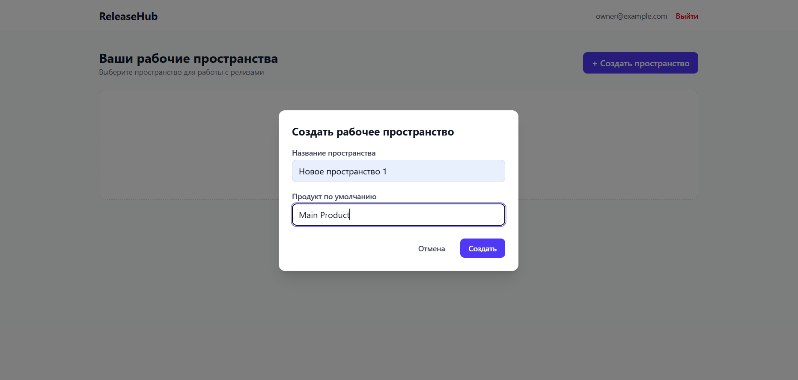
2. создаёт релиз:
   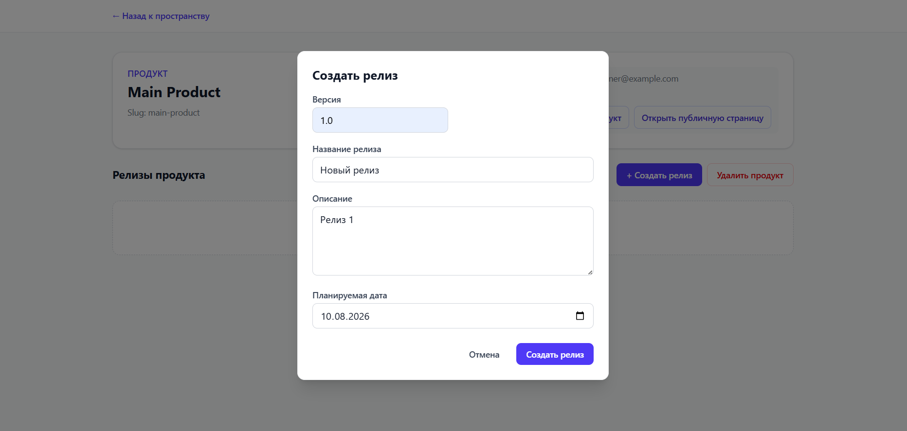
3. добавляет изменения;
   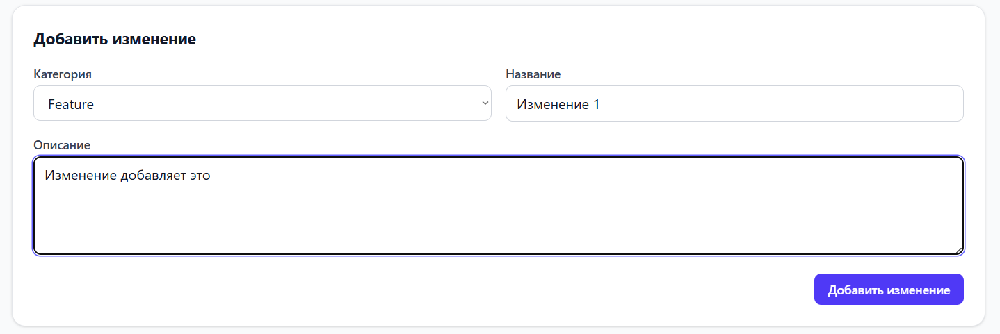
   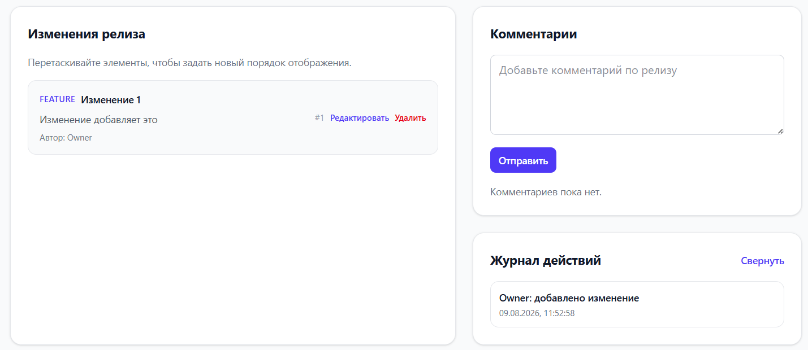
4. назначает согласующего;
   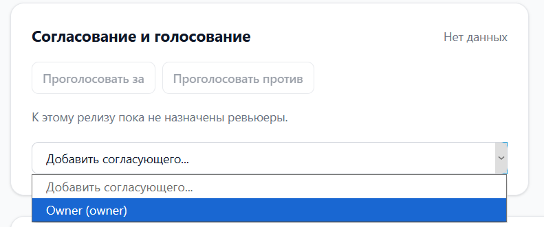
5. отправляет релиз на review.
   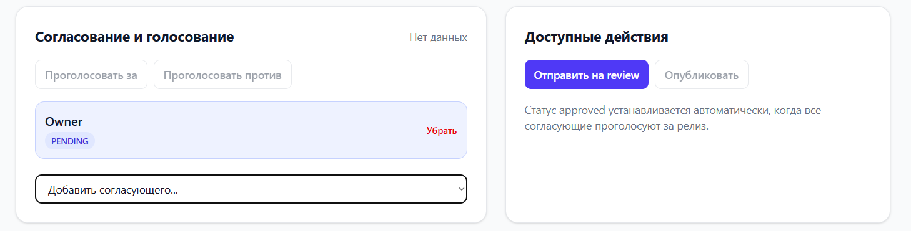
   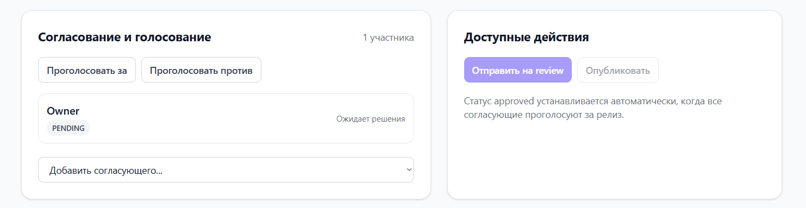

Сценарий 2:

1. Владелец приглашает нового пользователя:
   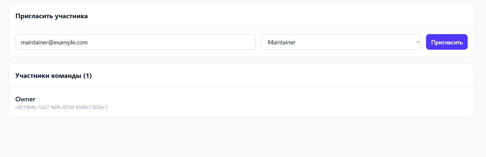
   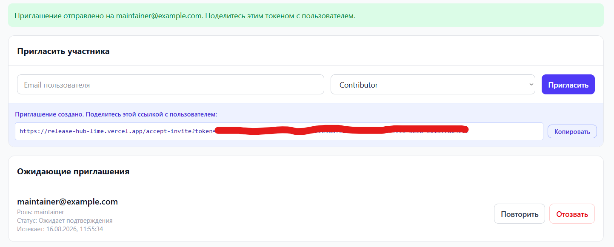
2. Maintainer согласовывает релиз;
   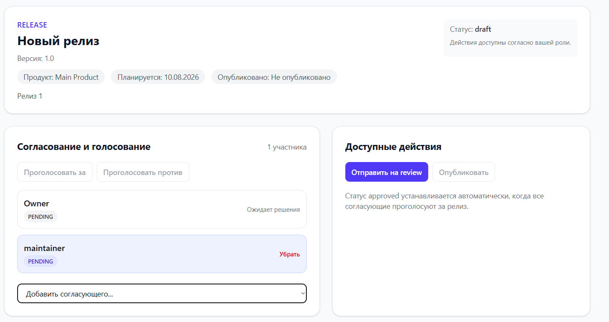
3. публикует его;
   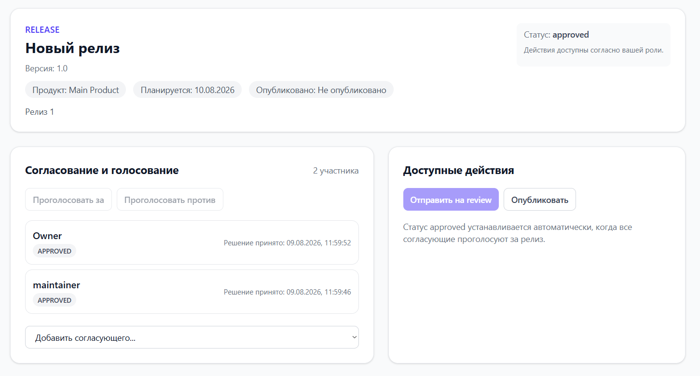
   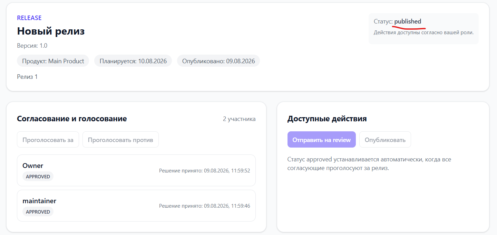
4. анонимный пользователь открывает публичную страницу release notes
   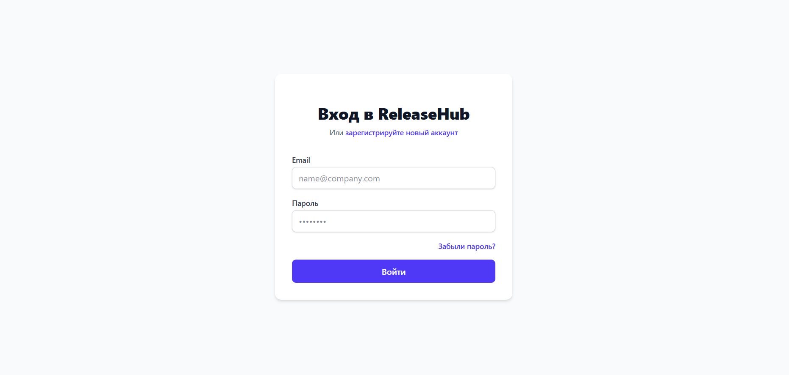
   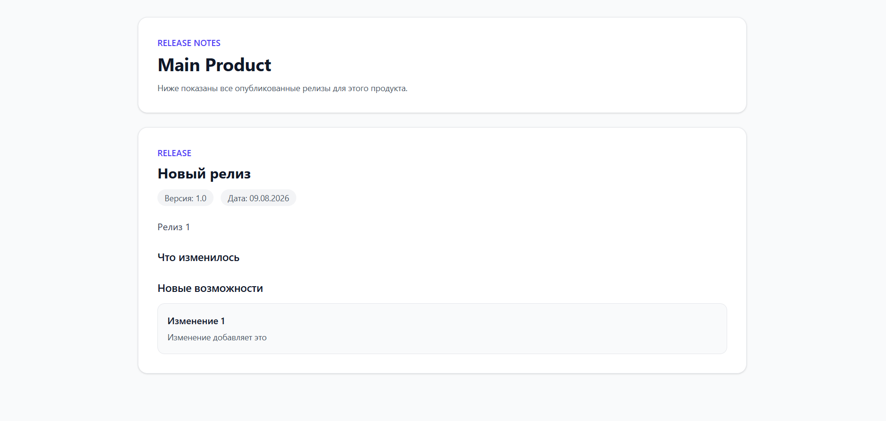
